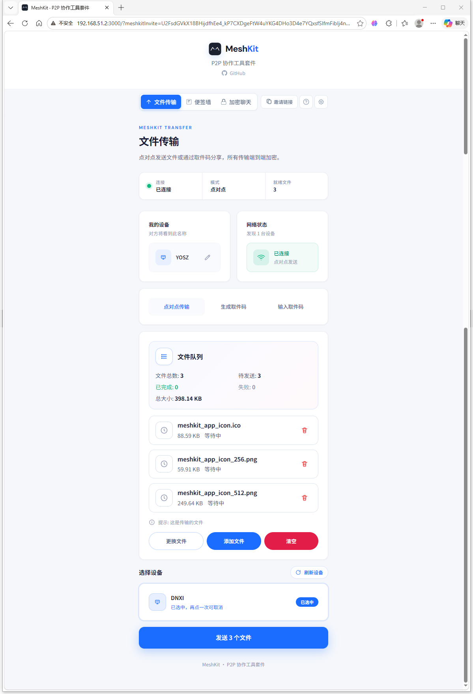
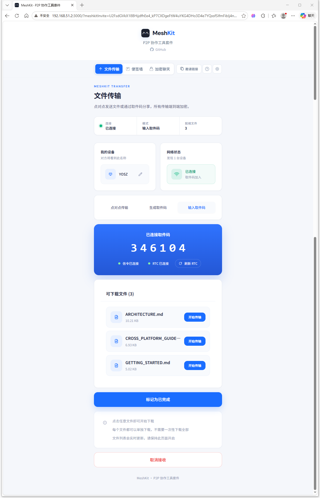
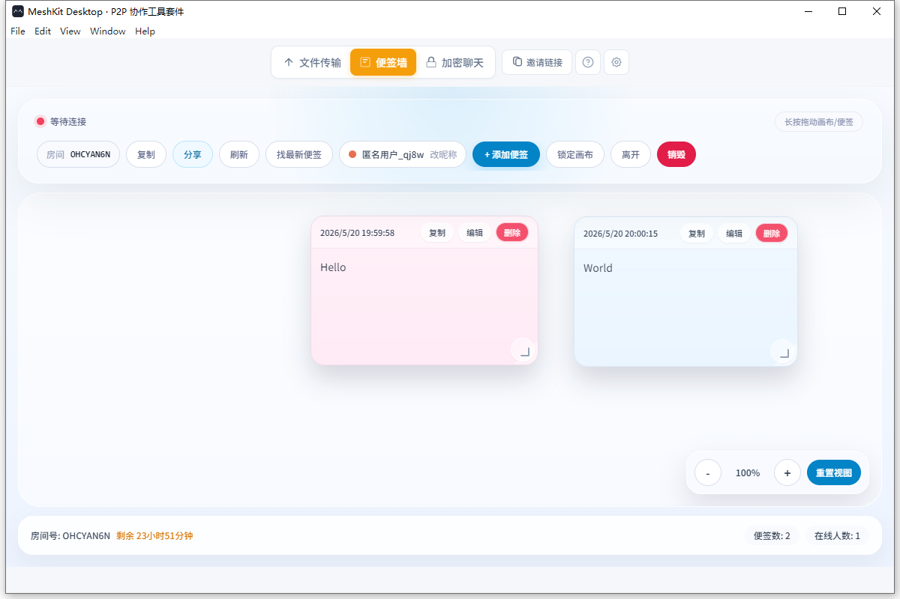
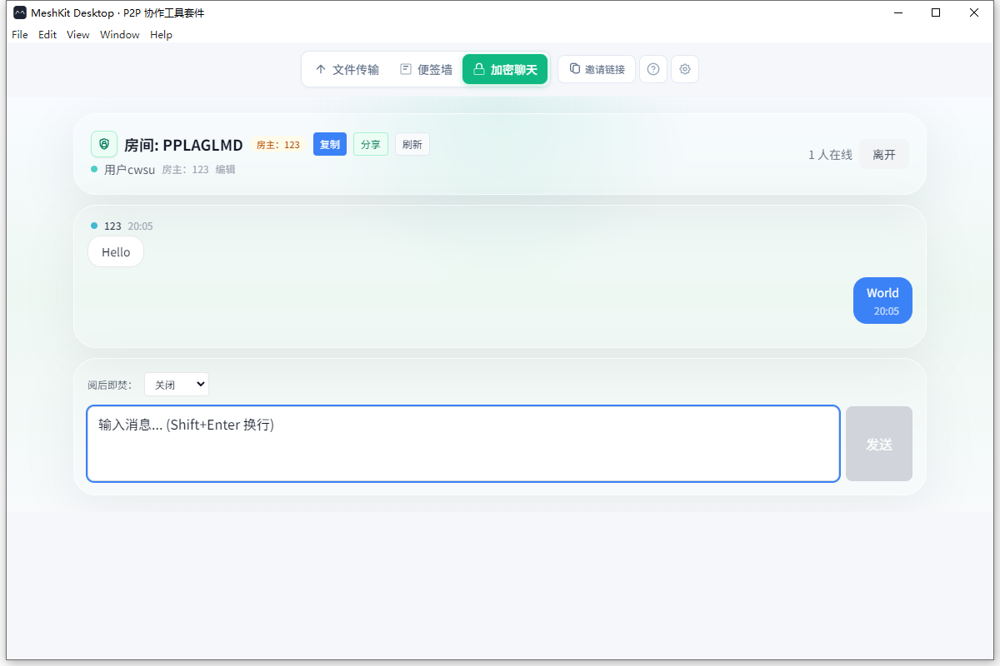

# MeshKit User Guide

[简体中文](../USER_GUIDE.md) | English

This guide is for everyday users and explains basic MeshKit `1.1.0` operations by task. For a shorter entry page, see [README](../../README.en.md).

## Startup

In development, run from the repository root:

```bash
pnpm install
pnpm --filter core build
pnpm dev
```

Or start modules separately:

```bash
pnpm dev:signaling
pnpm dev:web
pnpm dev:desktop
```

For Docker deployment, see [Docker Deployment](./DOCKER_DEPLOYMENT.md). For Windows and macOS installers, see [Version Release Notes](./VERSION_RELEASE.md).

## Screenshots

<p align="center">
  
  
</p>

<p align="center">
  
  
</p>

## File Transfer

### Peer-to-peer Sending

Sender:

1. Enter File Transfer.
2. Choose peer-to-peer transfer mode.
3. Select files or drag files into the page.
4. Select the target device.
5. Click Send and wait for the other side to confirm.

Receiver:

1. Stay on the File Transfer page.
2. Review the file list after receiving a request.
3. Accept the transfer and choose files to save.
4. Wait for transfer completion.
5. Save files and click Mark as Finished.

Tips:

- Both sides should avoid leaving the current page during transfer.
- The sender can cancel sending.
- If the other device is not visible, check signaling, LAN, and firewall.

### Using Pickup Codes

Sender:

1. Enter File Transfer.
2. Choose Create Pickup Code.
3. Add files to share.
4. Generate the 6-digit pickup code.
5. Send the pickup code, invite link, or QR code to the other side.

Receiver:

1. Enter File Transfer.
2. Choose Enter Pickup Code, or open the invite link directly.
3. Save the needed files after joining the room.
4. Click Mark as Finished after completion.

If RTC state is abnormal, click Refresh RTC. If the sender cancels sharing, the receiver gets a notification.

## Notes Wall

Create a room:

1. Enter Notes Wall.
2. Enter username.
3. Enter room ID, or use a random room ID.
4. Set room password and content encryption if needed.
5. Create and enter the room.

Join a room:

1. Enter username and room ID.
2. Enter the correct password if the room has one.
3. Collaborate on notes after entering.

Sharing and management:

- Invite members through invite links or QR codes.
- Recent rooms support quick return.
- The page shows owner information.
- Only the owner can destroy the room.
- Other members are notified and leave after room destruction.

## Encrypted Chat

Create or join a room:

1. Enter Encrypted Chat.
2. Enter username.
3. Enter room ID, or use a random room ID.
4. Set room password if needed.
5. Start chatting after entering the room.

Sharing and management:

- Supports invite links, QR codes, and QR downloads.
- Desktop can import these invite links.
- The page shows owner information.
- Only the owner can destroy the room.
- Other members are notified and leave after room destruction.

## Desktop Share Hub

Desktop is useful when you want a desktop app to start a local sharing entry. It currently supports Windows and macOS.

1. Start MeshKit Desktop.
2. Start local sharing services from Settings or Share Hub.
3. Send the share address to other LAN devices.
4. If you receive a Web invite link, paste it into Desktop to import it.
5. Desktop detects the link and jumps to the matching feature page.

If LAN devices cannot access the Desktop share address, check host IP, ports, and firewall. On macOS, if a system service occupies `7000`, Desktop uses later available ports automatically, and the share link includes the actual port.

## FAQ

### Cannot see other devices

- Confirm both sides are on the same network, or networks can reach each other.
- Confirm signaling service has started.
- Confirm WebSocket and PeerJS ports are not blocked by firewall. On Desktop, use the actual ports shown in Share Hub.
- Confirm connection address settings are correct.

### Invite link cannot open

- Confirm the link was not truncated by chat software.
- If it is a LAN address, confirm the current device is on the same network.
- If the link comes from Desktop, confirm Desktop sharing is still running.

### File transfer interrupted

- Both sides can re-enter the same page and try again.
- Click Refresh RTC to rebuild the connection.
- Check whether the browser blocked downloads or background page activity.

### Can the same room ID be reused after destruction?

Yes. Destruction clears this room state and notifies members to leave. It does not permanently invalidate the room ID. Using the same room ID later creates a new room.
