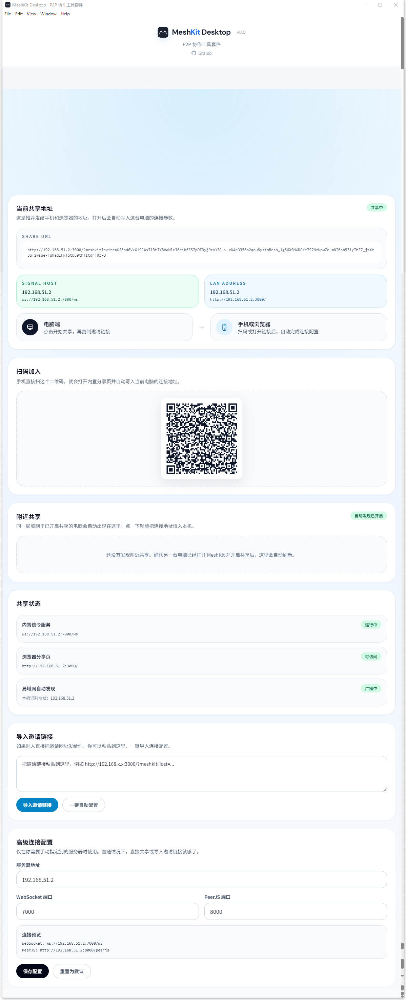
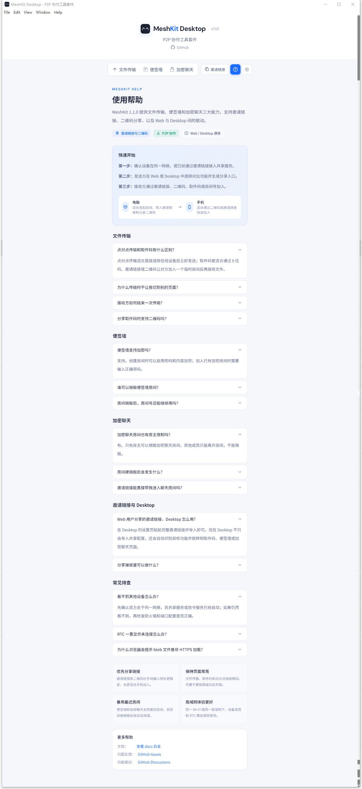

# MeshKit 功能介绍

本文档对应 MeshKit `1.1.0` 的当前功能。

## 1. 文件传输

MeshKit 的文件传输分为两种模式：点对点传输和取件码传输。

  

### 点对点传输

- 在线设备列表中选择目标设备。
- 支持单文件和多文件队列。
- 接收方会收到接收提醒，可选择接收或拒绝。
- 多文件传输时，接收方可以选择部分文件。
- 接收完成后，接收方需要点击“标记为已完成”，发送方才会解除等待。
- 发送方可以在等待确认、传输中、等待接收方完成时取消发送。

### 取件码传输

  

  

- 发送方选择文件后生成 6 位取件码。
- 接收方可以输入取件码，也可以通过邀请链接或二维码进入。
- 支持逐个保存文件。
- 支持刷新 RTC 连接。
- 房主取消发送后，接收方会收到提示并退出当前房间。

### 传输保护

- 活跃传输期间会限制切换页面，减少误操作导致的中断。
- 文件数据通过 WebRTC DataChannel 传输。
- signaling 服务只负责设备发现、房间状态和连接协调，不存储文件内容。

## 2. 便签墙

便签墙用于临时多人协作和轻量看板。

  

- 基于 Yjs 和 WebRTC 实时同步。
- 支持房间密码和内容加密配置。
- 支持最近房间，方便刷新后重进。
- 支持邀请链接、二维码和二维码下载。
- 支持房主信息展示。
- 仅房主可以销毁房间。
- 房间销毁后，其他成员会收到提示并退出。
- 移动端支持固定顶部栏、底部状态栏、缩放控件和长按拖动画布。

  

## 3. 加密聊天

加密聊天适合临时讨论和小范围沟通。

  

- 支持创建或加入房间。
- 支持房间密码验证。
- 支持最近房间和快速重进。
- 支持邀请链接、二维码和二维码下载。
- 支持房主信息展示。
- 仅房主可以销毁房间。
- 房间销毁后会通知其他成员退出。
- 支持消息自毁时间设置。

  

## 4. Desktop 共享中心

Desktop 版本除了界面外，也提供本机共享能力，当前支持 Windows 和 macOS。

  

- 自动托管内置信令服务。
- 自动托管浏览器分享页。
- 支持复制邀请链接。
- 支持显示二维码。
- 支持导入 Web 或 Desktop 生成的完整邀请链接。
- 导入后会自动保存连接配置并跳转到对应页面。
- macOS 上如果系统服务占用了默认端口，会自动切换到后续可用端口。

## 5. 邀请链接和二维码

邀请链接用于降低局域网使用门槛。

- Web 顶栏可以复制当前可分享链接。
- 文件传输、便签墙、加密聊天都可以生成对应房间链接。
- 分享弹层会显示二维码，并支持下载二维码图片。
- Desktop 可以读取完整邀请链接并自动配置主机、端口和目标功能。

注意：邀请链接可能携带连接参数、取件码、房间号或必要密码信息，请只分享给可信的人。

## 6. 帮助页

帮助页集中放置常用说明和使用入口，适合第一次使用时快速确认功能位置。

  

